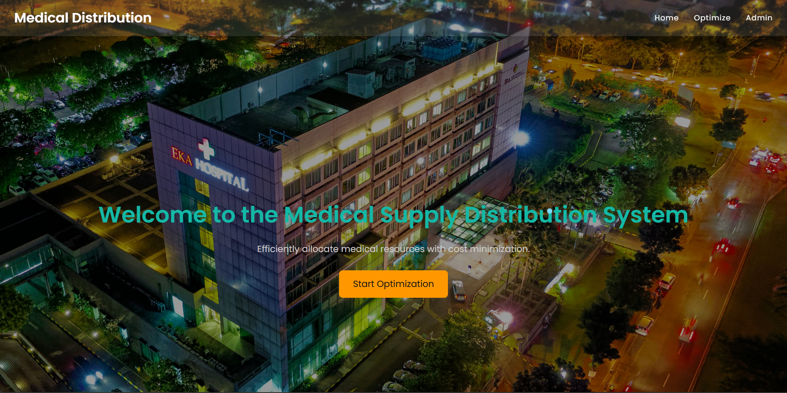
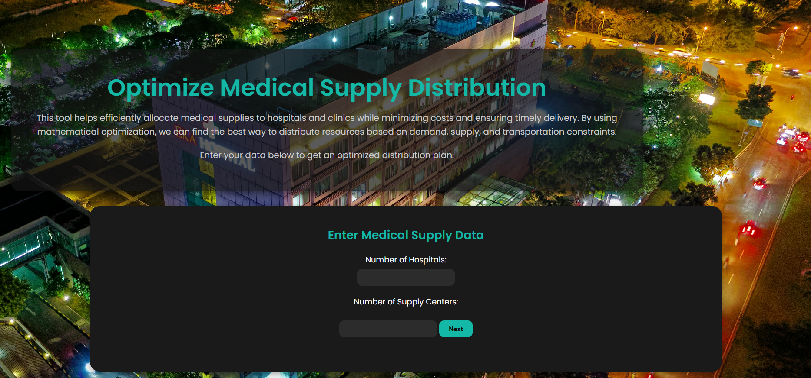
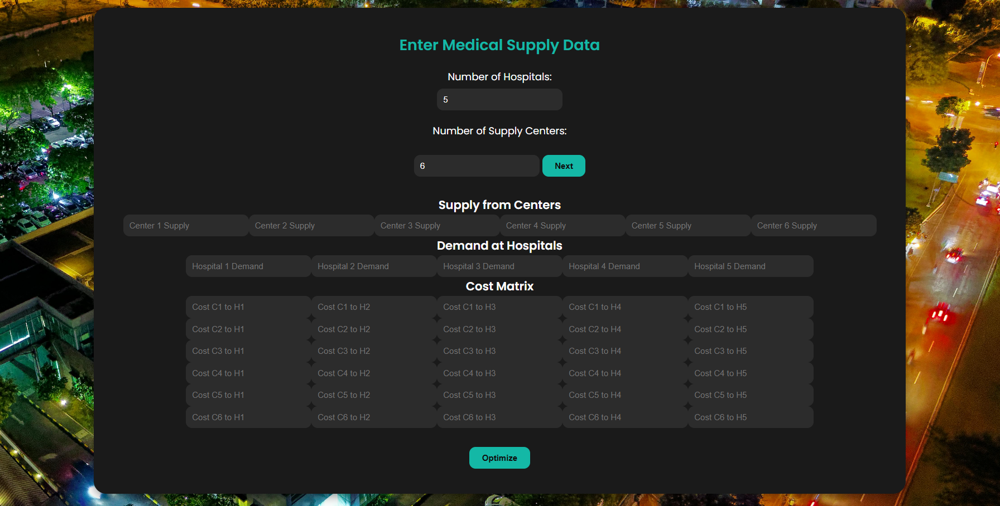

# Medical Supply Distribution

## Overview
A project aimed at optimizing the distribution process of medical supplies to ensure timely delivery and efficient resource allocation.This tool helps efficiently allocate medical supplies to hospitals and clinics while minimizing costs and ensuring timely delivery. By using mathematical optimization, we can find the best way to distribute resources based on demand, supply, and transportation constraints.

## Features
- Supply tracking and management  
- Route optimization for distribution  
- Inventory control and forecasting  
- Data visualization of supply chain metrics

## Installation
1. Clone the repository:
https://github.com/Charan545/MedicalSupplyDistributionProject.git
2. Install dependencies:
pip install -r requirements.txt

3. Run the application 

## Technologies Used
- Python  
- Pandas, NumPy for data processing  
- Matplotlib/Seaborn for visualization  
- Additional tools or libraries you used

## Contribution
Contributions are welcome! Please open issues or pull requests.

